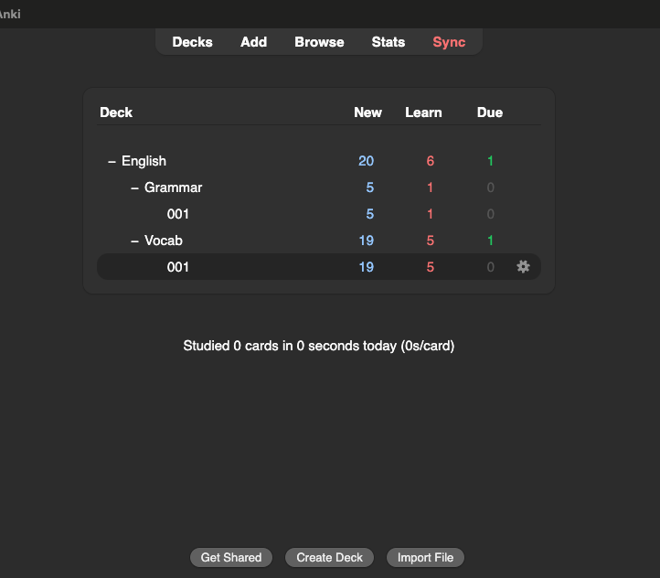
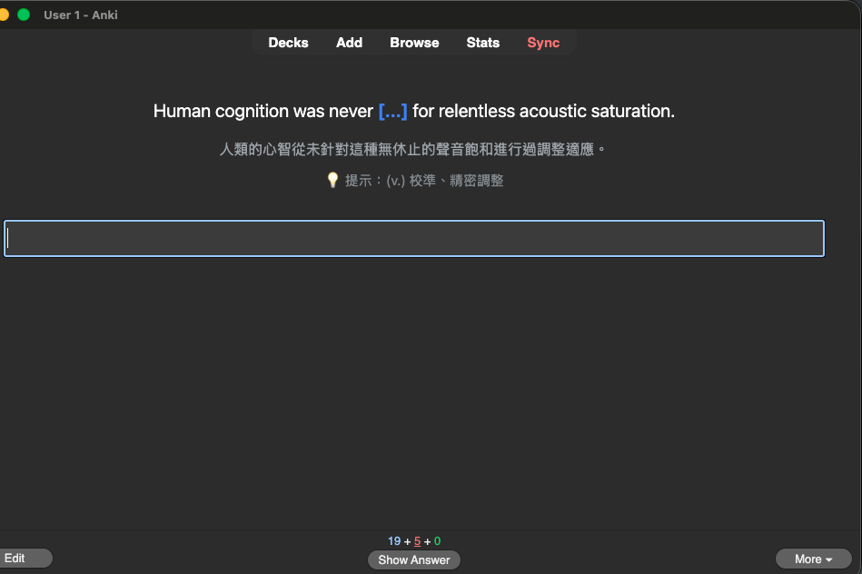
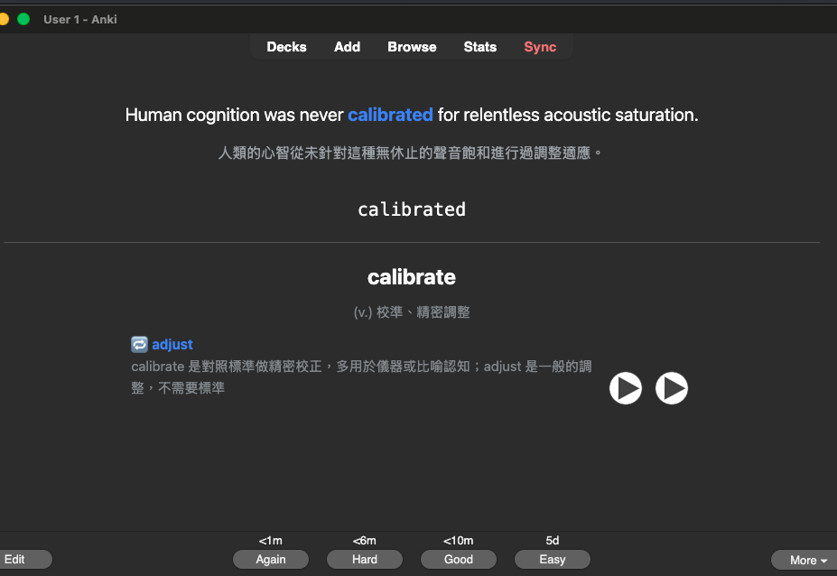

# learn_lang

Personal English-learning workspace. AI agents (Claude Code, Codex, Gemini CLI / Antigravity, ...) generate reading material, pull vocabulary and grammar out of it, and file everything into Anki as cloze cards with a typing box and pronunciation.

## How to use

The loop is: read, collect into Anki, drill; write, get corrected, collect the weak spots into Anki, drill.

### 1. Read and collect

1. Say **給我一篇英文文章** (optionally with a topic). The `reading` skill writes a ~5-minute C1 article with a breakdown of the hard vocabulary, grammar, and sentence patterns, saved under `.temp/articles/`. Say **唸給我聽** to hear it.
2. Ask about anything unclear, e.g. **be subjected to 是啥意思**. The `explain-english` skill explains it and offers to save it as a card.
3. Say **整理單字** and **整理文法**. The agent drafts the word list and the grammar exercises, you adjust or confirm, and they land in Anki as `English::Vocab::001` and `English::Grammar::001` (new batch decks open every 200 cards).

### 2. Drill in Anki

Open Anki and pick a batch deck. New cards go through three learning steps (`1m 10m 1h`) before they are scheduled for the next day.



A vocab card shows the sentence with the word blanked out, the Chinese translation, and a hint with the part of speech and meaning. Type the word and press Enter.



The back compares what you typed with the answer, shows the word, its meaning, one similar word with how the two differ, and reads the word and sentence aloud. Grade with the arrow keys (see [shortcuts](#shortcuts-in-the-anki-reviewer)).



Three keys come from the local add-ons in `tools/anki-addons/` and make drilling hands-on-keyboard:

| Key | Add-on | What it does |
|---|---|---|
| **← ↑ → ↓** | Arrow Grading | Again / Hard / Good / Easy on the back, then next card. Works even with a CJK input method active. |
| **Q** (or **Shift+Q**) | Repeat Card | Back to the front of the same card with the box cleared, nothing graded. Retype a word you got wrong right away. |
| **Space** (box empty) | Space Shows Answer | Reveal the answer without typing. |

The full key list, including Anki's built-in ones, is under [Shortcuts in the Anki reviewer](#shortcuts-in-the-anki-reviewer).

### 3. Write and collect

1. Paste something you wrote and say **幫我改這段**, or paste a diary entry and say **這是我今天的日記**. The `correct-writing` and `diary` skills correct it, give a C1–C2 rewrite (and, for a diary, an expanded version) with a score, and log everything under `.temp/writing/` and `.temp/diary/`.
2. Every week or two, say **整理我的寫作錯誤**. The `review-writing` skill reads those logs, reports the mistakes you keep making and the words you avoid, and turns the ones you pick into grammar and vocab cards built from your own corrected sentences.

## Anki setup

1. **Install Anki desktop** from https://apps.ankiweb.net (tested with 26.09).
2. **Install the add-ons** below via `Tools > Add-ons > Get Add-ons...`, or copy the local ones into `~/Library/Application Support/Anki2/addons21/`. Restart Anki after installing; add-ons only load at startup.

| Add-on | Source | Purpose |
|---|---|---|
| AnkiConnect | code `2055492159` | HTTP API on `127.0.0.1:8765`. Every agent action goes through it. Anki must be open. |
| Repeat Card | `tools/anki-addons/repeat_card/` (local) | Adds **Q** in the reviewer to show the current card's front again without grading it. |
| Arrow Grading | `tools/anki-addons/arrow_grading/` (local) | Grade with the arrow keys on the answer side: **←** Again, **↑** Hard, **→** Good, **↓** Easy. |
| Space Shows Answer | `tools/anki-addons/space_shows_answer/` (local) | **Space** shows the answer while the typing box is empty; with text in the box it is a normal space. |

3. **Note types and decks** are created by the agent on first use, or by hand with:

   ```sh
   python3 .agents/skills/anki/scripts/anki.py raw createModel "$(cat .agents/skills/anki/vocab_cloze_model.json)"
   python3 .agents/skills/anki/scripts/anki.py raw createModel "$(cat .agents/skills/anki/grammar_practice_model.json)"
   ```

   | Note type | Fields | Deck batches |
   |---|---|---|
   | `Vocab Cloze` | Word, Sentence, WordMeaning (with part of speech), SentenceMeaning, SimilarWord (one near-synonym and how the two differ, back only) | `English::Vocab::001`, `002`, ... (200 notes each) |
   | `Grammar Practice` | Target, GrammarPoint, Sentence, Prompt, SentenceMeaning, Explanation | `English::Grammar::001`, `002`, ... |

   Both card templates show a typing box on the front (`{{type:cloze:...}}`) and read the completed sentence aloud on the back with the macOS system voice (`{{tts en_US speed=1.2:cloze:Sentence}}`). The model JSON files are the source of truth; the agent syncs them whenever a template changes.

4. **Deck options.** Vocab and grammar decks use the `Vocab` preset: learning steps `1m 10m 1h`, so a new card must be answered correctly three times before it is scheduled for the next day. New batch decks inherit the parent's preset automatically.

## Skills

Skills live in `.agents/skills/`, the cross-tool location scanned natively by Codex, Gemini CLI, Antigravity, and others. Claude Code reads `.claude/skills/`, which holds one symlink per skill; run `scripts/link-skills.sh` after adding or removing a skill. `AGENTS.md` (imported by `CLAUDE.md`) tells every agent where to look. Format and conventions: `.agents/skills/README.md`.

| Skill | What it does | Say something like |
|---|---|---|
| `reading` | Writes a ~5-minute C1 English article on a topic, then breaks down the hard vocabulary, grammar, and sentence patterns. Saves the result to `.temp/articles/<date>-<title>.md`. | 給我一篇英文文章 |
| `explain-english` | Explains an English word, phrase, or sentence in Traditional Chinese, then asks whether to save it as a vocab or grammar card. | be subjected to 是啥意思 |
| `vocab-to-anki` | Pulls key words from the current context into `.temp/vocab.txt`, lets you add or remove words, then files them as `Vocab Cloze` cards. | 整理單字到 anki |
| `grammar-to-anki` | Picks 2–4 C1-level grammar structures from the context, drafts cloze exercises into `.temp/grammar.json`, then files them as `Grammar Practice` cards. | 把文法存到 anki |
| `correct-writing` | Corrects a passage you wrote, keeping your wording; gives a C1–C2 rewrite and a score; appends the original and correction to `.temp/writing/<date>.txt`. | 幫我改這段 |
| `diary` | Runs the full `correct-writing` treatment on a diary entry, then expands the C1–C2 rewrite into a richer entry; appends original, corrected, rewritten, and expanded text to `.temp/diary/<month>-w<week>.txt`. | 這是我今天的日記 |
| `review-writing` | Reads `.temp/writing/` and `.temp/diary/`, reports your recurring mistakes and weak vocabulary, then files the chosen items as grammar and vocab cards via the two card skills. | 整理我的寫作錯誤 |
| `read-aloud` | Reads English aloud with macOS `say`: pasted text, an entry from `.temp/writing/` or `.temp/diary/` by `#N`, or an article from `.temp/articles/`. `correct-writing` and `diary` offer this for the C1–C2 rewrite. | 唸給我聽 / 唸 diary #2 |
| `reset-deck` | Resets every card in a deck back to New (`forgetCards`), so the whole deck comes up for study again. Nothing is deleted. | reset vocab/001 |
| `anki` | Transport layer used by the card skills: `anki.py` wraps AnkiConnect with `decks`, `models`, `fields`, `list`, `add`, `update`, `batch`, and `raw`. Call it directly to search or fix cards. | 這週加了哪些字 |

Typical session: ask for an article, read it, say 整理單字 and 整理文法, confirm the drafts, then review in Anki.

## Shortcuts in the Anki reviewer

Rows marked **add-on** come from `tools/anki-addons/`; the rest are built into Anki.

| Key | Action |
|---|---|
| Type the word, then **Enter** | Submit the typed answer and show the back with a letter-by-letter comparison. |
| **Space** (box empty) | **Add-on.** Space Shows Answer: reveal the answer without typing. |
| **1 / 2 / 3 / 4** | Again / Hard / Good / Easy. **Enter** or **Space** on the back also means Good. Anki never grades the typed answer for you: if the comparison is red, press **1**. With the Zhuyin (注音) input method active these keys become ㄅㄉˇˋ and never reach Anki; switch to ABC while reviewing, or press **Cmd+1..4** instead. |
| **← / ↑ / → / ↓** | **Add-on.** Arrow Grading: Again / Hard / Good / Easy on the answer side, then next card. Not affected by the input method. |
| **Q** | **Add-on.** Repeat Card: back to the front of the same card, typing box cleared, nothing graded. Safe to press any number of times. With Zhuyin active press **Shift+Q**. |
| **R** | Replay the audio. |
| **E** | Edit the current note. |
| **Esc** | Leave the reviewer. |
| **Cmd+Z** | Undo. Avoid this for drilling: it also reverts notes added or deleted through AnkiConnect and template changes, in order, one per press. Check what the `Edit` menu says will be undone before pressing it. |

## Layout

```
AGENTS.md / CLAUDE.md          agent instructions (CLAUDE.md just imports AGENTS.md)
.agents/skills/<name>/SKILL.md skills (source of truth)
.agents/skills/anki/scripts/anki.py         AnkiConnect CLI
.agents/skills/anki/*_model.json            note type definitions
.claude/skills/                symlinks for Claude Code (generated)
scripts/link-skills.sh         regenerates those symlinks
tools/anki-addons/             local Anki add-ons
docs/images/                   screenshots used in this README
.temp/                         drafts the skills write and delete
```
